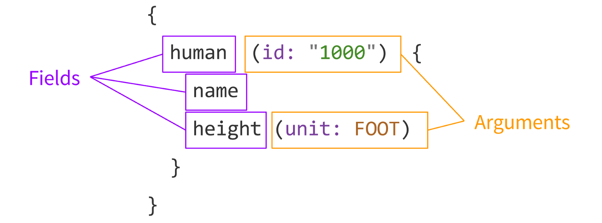

GraphQL is a query language for your API.

Instead of having multiple "dumb" endpoints, have a single "smart" endpoints,

Practically speaking, the GraphQL layer lives between the client and one or more data sources, 

A GraphQL API is organized around three main building blocks: the **scheme**, **queries**, and **resolvers**.

### Queries

        query {
          stuff
        }

Some general concepts:

- GraphQL document: 

- Operation: A

What are the different parts of a basic operation?

This document shows off the main building blocks of GraphQL, which specify the data you are trying to fetch.

- Filed: A unit of data you are asking for, which ends up as a field in your JSON response data.

- Arguments: A set of key-value pairs attached to a specific field.

There are three optional parts to a GraphQL operation which are not used above.

- Operation type: This is either *query*, *mutation*, or *subscription*.

- Operation name:

- Variable definitions:

Variables are passed separately from the query 

We start with a special "root" object.

### Resolvers

Your GraphQL server won't know what to do with an incoming query unless you tell it using a **resolver**.

After being validated, a GraphQL query is executed by a GraphQL server which returns a result that mirrors the shape of the requested query, typically as JSON.